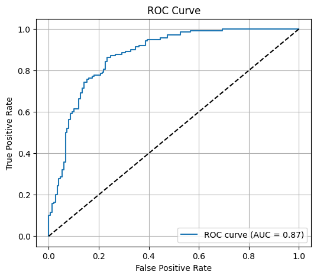
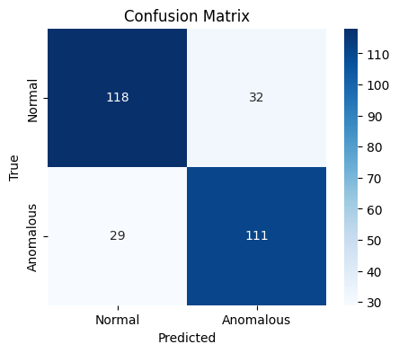
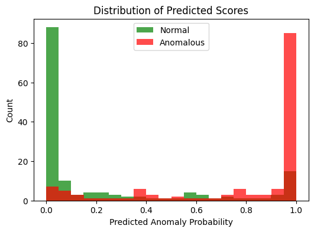

# 🎥 Anomalous Behavior Detection in Videos using BiLSTM

This repository implements the approach from the paper:
📄 [A New Approach to Detect Anomalous Behavior in Video Surveillance](https://ieeexplore.ieee.org/document/9074417)

The goal is to detect **anomalous events** (e.g., abuse, arrest, fights) in long untrimmed videos, using video frames converted into feature sequences and classified via a **BiLSTM model**.

---

## 📂 Dataset

We use the **UCF-Crime Dataset**, available on Kaggle:
👉 [UCF-Crime Dataset](https://www.kaggle.com/datasets/odins0n/ucf-crime-dataset)

### Dataset Structure

ucf-crime-dataset/
├── Train/
│ ├── Abuse/
│ ├── Arrest/
│ ├── ...
│
└── Test/
├── Abuse/
├── Normal/
├── ...

Each folder contains **video frames** extracted from videos (e.g., `Abuse028_x264_1410.jpg`).

---

## ⚙️ Pipeline

1. **Dataset Preparation**

   - Group frames by video (based on filename prefix or folder name).
   - Assign labels (Normal = 0, Anomalous = 1).
2. **Feature Extraction**

   - Use **ResNet-50 pretrained on ImageNet** to extract a **2048-D feature vector** per frame.
   - Save features as `.npy` files per video.
3. **Sequence Generation**

   - Slice features into sequences of length `SEQ_LEN` (default 12) with stride `STRIDE` (default 6).
4. **Model Training**

   - Train a **BiLSTM classifier** on the sequences.
   - Optimizer: Adam, Loss: CrossEntropy.
5. **Evaluation**

   - Aggregate sequence predictions → video-level anomaly scores.
   - Compute metrics: Accuracy, Precision, Recall, F1, ROC-AUC.
   - Visualize results.

---

## 📊 Results

Here are some evaluation plots:

- **ROC Curve**
- **Confusion Matrix**
- **Distribution of Predicted Scores**

---

## 🚀 Usage

### 1. Clone and install requirements

```bash
git clone https://github.com/your-repo/anomalous-behavior-detection.git
cd anomalous-behavior-detection
pip install -r requirements.txt
```
